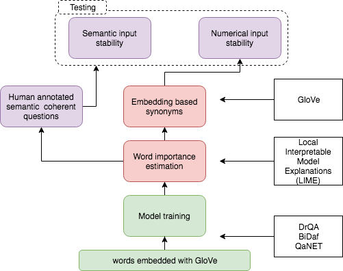

# Are you tough enough? Framework for Robustness Validation of Machine Comprehension Systems

This repository contains dataset for robustness validation of machine comprehension systems trained on SQuAD dataset.
It was created with WordNet synonyms embedded with ELMo and manually corrected by annotators.

**A robust model should be robust to changes in input that do not alter its semantics.**
We test this property of 3 popular models: DrQA, BiDAF and QANet by manipulating questions in two ways-
swapping important question word for:

1) its semantically correct synonym and
2) for word vector that is close in embedding space.

We estimate importance of words in asked questions with Locally Interpretable Model Agnostic Explanations method (LIME). 

More details can be found in the paper accepted to NIPS IRASL workshop https://arxiv.org/abs/1812.02205

*This framework is in progress and will be updated.*

